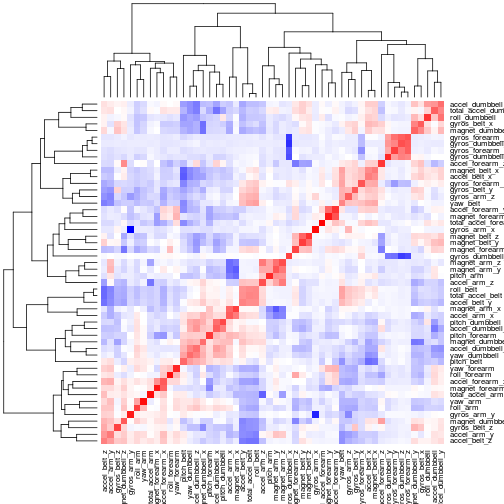

# Building Predictive Model For Determining Fitness Exercise Correctness

### Practical Machine Learning Assignment Writeup

## Abstract

In this assignment, I build a predictive model to determine whether a
particular form of exercise (barbell lifting) is performed correctly, using
accelerometer data. The data set used is originally from [1].

## Data Retrieval

The dataset from [1] can be downloaded as follows:


```r
if (!file.exists("./pml-training.csv")) {
    download.file("http://d396qusza40orc.cloudfront.net/predmachlearn/pml-training.csv", 
        destfile = "./pml-training.csv")
}
if (!file.exists("./pml-testing.csv")) {
    download.file("http://d396qusza40orc.cloudfront.net/predmachlearn/pml-testing.csv", 
        destfile = "./pml-testing.csv")
}
```


The data is in standard CSV format and can be loaded into R using the usual
facilities for working with CSV data:


```r
pml.training <- read.csv("./pml-training.csv")
pml.testing <- read.csv("./pml-testing.csv")
```


## Exploratory Analysis

The training set consists of 19622 observations of 160 variables, one of which
is the dependent variable as far as this study is concerned:


```r
dim(pml.training)
```

```
## [1] 19622   160
```


Inspection of the data set indicates that many of the 159 predictors are
missing in most of the observations:


```r
sum(complete.cases(pml.training))
```

```
## [1] 406
```

```r
head(pml.training)
```

```
##   X user_name raw_timestamp_part_1 raw_timestamp_part_2   cvtd_timestamp
## 1 1  carlitos           1323084231               788290 05/12/2011 11:23
## 2 2  carlitos           1323084231               808298 05/12/2011 11:23
## 3 3  carlitos           1323084231               820366 05/12/2011 11:23
## 4 4  carlitos           1323084232               120339 05/12/2011 11:23
## 5 5  carlitos           1323084232               196328 05/12/2011 11:23
## 6 6  carlitos           1323084232               304277 05/12/2011 11:23
##   new_window num_window roll_belt pitch_belt yaw_belt total_accel_belt
## 1         no         11      1.41       8.07    -94.4                3
## 2         no         11      1.41       8.07    -94.4                3
## 3         no         11      1.42       8.07    -94.4                3
## 4         no         12      1.48       8.05    -94.4                3
## 5         no         12      1.48       8.07    -94.4                3
## 6         no         12      1.45       8.06    -94.4                3
##   kurtosis_roll_belt kurtosis_picth_belt kurtosis_yaw_belt
## 1                                                         
## 2                                                         
## 3                                                         
## 4                                                         
## 5                                                         
## 6                                                         
##   skewness_roll_belt skewness_roll_belt.1 skewness_yaw_belt max_roll_belt
## 1                                                                      NA
## 2                                                                      NA
## 3                                                                      NA
## 4                                                                      NA
## 5                                                                      NA
## 6                                                                      NA
##   max_picth_belt max_yaw_belt min_roll_belt min_pitch_belt min_yaw_belt
## 1             NA                         NA             NA             
## 2             NA                         NA             NA             
## 3             NA                         NA             NA             
## 4             NA                         NA             NA             
## 5             NA                         NA             NA             
## 6             NA                         NA             NA             
##   amplitude_roll_belt amplitude_pitch_belt amplitude_yaw_belt
## 1                  NA                   NA                   
## 2                  NA                   NA                   
## 3                  NA                   NA                   
## 4                  NA                   NA                   
## 5                  NA                   NA                   
## 6                  NA                   NA                   
##   var_total_accel_belt avg_roll_belt stddev_roll_belt var_roll_belt
## 1                   NA            NA               NA            NA
## 2                   NA            NA               NA            NA
## 3                   NA            NA               NA            NA
## 4                   NA            NA               NA            NA
## 5                   NA            NA               NA            NA
## 6                   NA            NA               NA            NA
##   avg_pitch_belt stddev_pitch_belt var_pitch_belt avg_yaw_belt
## 1             NA                NA             NA           NA
## 2             NA                NA             NA           NA
## 3             NA                NA             NA           NA
## 4             NA                NA             NA           NA
## 5             NA                NA             NA           NA
## 6             NA                NA             NA           NA
##   stddev_yaw_belt var_yaw_belt gyros_belt_x gyros_belt_y gyros_belt_z
## 1              NA           NA         0.00         0.00        -0.02
## 2              NA           NA         0.02         0.00        -0.02
## 3              NA           NA         0.00         0.00        -0.02
## 4              NA           NA         0.02         0.00        -0.03
## 5              NA           NA         0.02         0.02        -0.02
## 6              NA           NA         0.02         0.00        -0.02
##   accel_belt_x accel_belt_y accel_belt_z magnet_belt_x magnet_belt_y
## 1          -21            4           22            -3           599
## 2          -22            4           22            -7           608
## 3          -20            5           23            -2           600
## 4          -22            3           21            -6           604
## 5          -21            2           24            -6           600
## 6          -21            4           21             0           603
##   magnet_belt_z roll_arm pitch_arm yaw_arm total_accel_arm var_accel_arm
## 1          -313     -128      22.5    -161              34            NA
## 2          -311     -128      22.5    -161              34            NA
## 3          -305     -128      22.5    -161              34            NA
## 4          -310     -128      22.1    -161              34            NA
## 5          -302     -128      22.1    -161              34            NA
## 6          -312     -128      22.0    -161              34            NA
##   avg_roll_arm stddev_roll_arm var_roll_arm avg_pitch_arm stddev_pitch_arm
## 1           NA              NA           NA            NA               NA
## 2           NA              NA           NA            NA               NA
## 3           NA              NA           NA            NA               NA
## 4           NA              NA           NA            NA               NA
## 5           NA              NA           NA            NA               NA
## 6           NA              NA           NA            NA               NA
##   var_pitch_arm avg_yaw_arm stddev_yaw_arm var_yaw_arm gyros_arm_x
## 1            NA          NA             NA          NA        0.00
## 2            NA          NA             NA          NA        0.02
## 3            NA          NA             NA          NA        0.02
## 4            NA          NA             NA          NA        0.02
## 5            NA          NA             NA          NA        0.00
## 6            NA          NA             NA          NA        0.02
##   gyros_arm_y gyros_arm_z accel_arm_x accel_arm_y accel_arm_z magnet_arm_x
## 1        0.00       -0.02        -288         109        -123         -368
## 2       -0.02       -0.02        -290         110        -125         -369
## 3       -0.02       -0.02        -289         110        -126         -368
## 4       -0.03        0.02        -289         111        -123         -372
## 5       -0.03        0.00        -289         111        -123         -374
## 6       -0.03        0.00        -289         111        -122         -369
##   magnet_arm_y magnet_arm_z kurtosis_roll_arm kurtosis_picth_arm
## 1          337          516                                     
## 2          337          513                                     
## 3          344          513                                     
## 4          344          512                                     
## 5          337          506                                     
## 6          342          513                                     
##   kurtosis_yaw_arm skewness_roll_arm skewness_pitch_arm skewness_yaw_arm
## 1                                                                       
## 2                                                                       
## 3                                                                       
## 4                                                                       
## 5                                                                       
## 6                                                                       
##   max_roll_arm max_picth_arm max_yaw_arm min_roll_arm min_pitch_arm
## 1           NA            NA          NA           NA            NA
## 2           NA            NA          NA           NA            NA
## 3           NA            NA          NA           NA            NA
## 4           NA            NA          NA           NA            NA
## 5           NA            NA          NA           NA            NA
## 6           NA            NA          NA           NA            NA
##   min_yaw_arm amplitude_roll_arm amplitude_pitch_arm amplitude_yaw_arm
## 1          NA                 NA                  NA                NA
## 2          NA                 NA                  NA                NA
## 3          NA                 NA                  NA                NA
## 4          NA                 NA                  NA                NA
## 5          NA                 NA                  NA                NA
## 6          NA                 NA                  NA                NA
##   roll_dumbbell pitch_dumbbell yaw_dumbbell kurtosis_roll_dumbbell
## 1         13.05         -70.49       -84.87                       
## 2         13.13         -70.64       -84.71                       
## 3         12.85         -70.28       -85.14                       
## 4         13.43         -70.39       -84.87                       
## 5         13.38         -70.43       -84.85                       
## 6         13.38         -70.82       -84.47                       
##   kurtosis_picth_dumbbell kurtosis_yaw_dumbbell skewness_roll_dumbbell
## 1                                                                     
## 2                                                                     
## 3                                                                     
## 4                                                                     
## 5                                                                     
## 6                                                                     
##   skewness_pitch_dumbbell skewness_yaw_dumbbell max_roll_dumbbell
## 1                                                              NA
## 2                                                              NA
## 3                                                              NA
## 4                                                              NA
## 5                                                              NA
## 6                                                              NA
##   max_picth_dumbbell max_yaw_dumbbell min_roll_dumbbell min_pitch_dumbbell
## 1                 NA                                 NA                 NA
## 2                 NA                                 NA                 NA
## 3                 NA                                 NA                 NA
## 4                 NA                                 NA                 NA
## 5                 NA                                 NA                 NA
## 6                 NA                                 NA                 NA
##   min_yaw_dumbbell amplitude_roll_dumbbell amplitude_pitch_dumbbell
## 1                                       NA                       NA
## 2                                       NA                       NA
## 3                                       NA                       NA
## 4                                       NA                       NA
## 5                                       NA                       NA
## 6                                       NA                       NA
##   amplitude_yaw_dumbbell total_accel_dumbbell var_accel_dumbbell
## 1                                          37                 NA
## 2                                          37                 NA
## 3                                          37                 NA
## 4                                          37                 NA
## 5                                          37                 NA
## 6                                          37                 NA
##   avg_roll_dumbbell stddev_roll_dumbbell var_roll_dumbbell
## 1                NA                   NA                NA
## 2                NA                   NA                NA
## 3                NA                   NA                NA
## 4                NA                   NA                NA
## 5                NA                   NA                NA
## 6                NA                   NA                NA
##   avg_pitch_dumbbell stddev_pitch_dumbbell var_pitch_dumbbell
## 1                 NA                    NA                 NA
## 2                 NA                    NA                 NA
## 3                 NA                    NA                 NA
## 4                 NA                    NA                 NA
## 5                 NA                    NA                 NA
## 6                 NA                    NA                 NA
##   avg_yaw_dumbbell stddev_yaw_dumbbell var_yaw_dumbbell gyros_dumbbell_x
## 1               NA                  NA               NA                0
## 2               NA                  NA               NA                0
## 3               NA                  NA               NA                0
## 4               NA                  NA               NA                0
## 5               NA                  NA               NA                0
## 6               NA                  NA               NA                0
##   gyros_dumbbell_y gyros_dumbbell_z accel_dumbbell_x accel_dumbbell_y
## 1            -0.02             0.00             -234               47
## 2            -0.02             0.00             -233               47
## 3            -0.02             0.00             -232               46
## 4            -0.02            -0.02             -232               48
## 5            -0.02             0.00             -233               48
## 6            -0.02             0.00             -234               48
##   accel_dumbbell_z magnet_dumbbell_x magnet_dumbbell_y magnet_dumbbell_z
## 1             -271              -559               293               -65
## 2             -269              -555               296               -64
## 3             -270              -561               298               -63
## 4             -269              -552               303               -60
## 5             -270              -554               292               -68
## 6             -269              -558               294               -66
##   roll_forearm pitch_forearm yaw_forearm kurtosis_roll_forearm
## 1         28.4         -63.9        -153                      
## 2         28.3         -63.9        -153                      
## 3         28.3         -63.9        -152                      
## 4         28.1         -63.9        -152                      
## 5         28.0         -63.9        -152                      
## 6         27.9         -63.9        -152                      
##   kurtosis_picth_forearm kurtosis_yaw_forearm skewness_roll_forearm
## 1                                                                  
## 2                                                                  
## 3                                                                  
## 4                                                                  
## 5                                                                  
## 6                                                                  
##   skewness_pitch_forearm skewness_yaw_forearm max_roll_forearm
## 1                                                           NA
## 2                                                           NA
## 3                                                           NA
## 4                                                           NA
## 5                                                           NA
## 6                                                           NA
##   max_picth_forearm max_yaw_forearm min_roll_forearm min_pitch_forearm
## 1                NA                               NA                NA
## 2                NA                               NA                NA
## 3                NA                               NA                NA
## 4                NA                               NA                NA
## 5                NA                               NA                NA
## 6                NA                               NA                NA
##   min_yaw_forearm amplitude_roll_forearm amplitude_pitch_forearm
## 1                                     NA                      NA
## 2                                     NA                      NA
## 3                                     NA                      NA
## 4                                     NA                      NA
## 5                                     NA                      NA
## 6                                     NA                      NA
##   amplitude_yaw_forearm total_accel_forearm var_accel_forearm
## 1                                        36                NA
## 2                                        36                NA
## 3                                        36                NA
## 4                                        36                NA
## 5                                        36                NA
## 6                                        36                NA
##   avg_roll_forearm stddev_roll_forearm var_roll_forearm avg_pitch_forearm
## 1               NA                  NA               NA                NA
## 2               NA                  NA               NA                NA
## 3               NA                  NA               NA                NA
## 4               NA                  NA               NA                NA
## 5               NA                  NA               NA                NA
## 6               NA                  NA               NA                NA
##   stddev_pitch_forearm var_pitch_forearm avg_yaw_forearm
## 1                   NA                NA              NA
## 2                   NA                NA              NA
## 3                   NA                NA              NA
## 4                   NA                NA              NA
## 5                   NA                NA              NA
## 6                   NA                NA              NA
##   stddev_yaw_forearm var_yaw_forearm gyros_forearm_x gyros_forearm_y
## 1                 NA              NA            0.03            0.00
## 2                 NA              NA            0.02            0.00
## 3                 NA              NA            0.03           -0.02
## 4                 NA              NA            0.02           -0.02
## 5                 NA              NA            0.02            0.00
## 6                 NA              NA            0.02           -0.02
##   gyros_forearm_z accel_forearm_x accel_forearm_y accel_forearm_z
## 1           -0.02             192             203            -215
## 2           -0.02             192             203            -216
## 3            0.00             196             204            -213
## 4            0.00             189             206            -214
## 5           -0.02             189             206            -214
## 6           -0.03             193             203            -215
##   magnet_forearm_x magnet_forearm_y magnet_forearm_z classe
## 1              -17              654              476      A
## 2              -18              661              473      A
## 3              -18              658              469      A
## 4              -16              658              469      A
## 5              -17              655              473      A
## 6               -9              660              478      A
```


Choosing between discarding most of the observations but using more predictors
and discarding some predictors to keep most of the observations is easy: more
observations are always a good thing, while additional variables may or may
not be helpful.

Additionally, it's worth noting that some of the variables in the data set do
not come from accelerometer measurements and record experimental setup or
participants' data. Treating those as potential confounders is a sane thing to
do, so in addition to predictors with missing data, I also discarded the
following variables: X, user_name, raw_timestamp_part1, raw_timestamp_part2,
cvtd_timestamp, new_window and num_window.


```r
include.cols <- c("roll_belt", "pitch_belt", "yaw_belt", "total_accel_belt", 
    "gyros_belt_x", "gyros_belt_y", "gyros_belt_z", "accel_belt_x", "accel_belt_y", 
    "accel_belt_z", "magnet_belt_x", "magnet_belt_y", "magnet_belt_z", "roll_arm", 
    "pitch_arm", "yaw_arm", "total_accel_arm", "gyros_arm_x", "gyros_arm_y", 
    "gyros_arm_z", "accel_arm_x", "accel_arm_y", "accel_arm_z", "magnet_arm_x", 
    "magnet_arm_y", "magnet_arm_z", "roll_dumbbell", "pitch_dumbbell", "yaw_dumbbell", 
    "total_accel_dumbbell", "gyros_dumbbell_x", "gyros_dumbbell_y", "gyros_dumbbell_z", 
    "accel_dumbbell_x", "accel_dumbbell_y", "accel_dumbbell_z", "magnet_dumbbell_x", 
    "magnet_dumbbell_y", "magnet_dumbbell_z", "roll_forearm", "pitch_forearm", 
    "yaw_forearm", "total_accel_forearm", "gyros_forearm_x", "gyros_forearm_y", 
    "gyros_forearm_z", "accel_forearm_x", "accel_forearm_y", "accel_forearm_z", 
    "magnet_forearm_x", "magnet_forearm_y", "magnet_forearm_z")
proc.pml.testing <- pml.testing[, include.cols]
include.cols <- c(include.cols, "classe")
proc.pml.training <- pml.training[, include.cols]
```


Performing this transformation results in a data set of 19622 observations of
53 variables (one of which is the dependent variable "classe").


```r
dim(proc.pml.training)
```

```
## [1] 19622    53
```

```r
sum(complete.cases(proc.pml.training))
```

```
## [1] 19622
```


Now that I've cleaned up the data set, it would make sense to explore
associations in the data.


```r
pred.corr <- cor(proc.pml.training[, names(proc.pml.training) != "classe"])
pal <- colorRampPalette(c("blue", "white", "red"))(n = 199)
heatmap(pred.corr, col = pal)
```

 


As can be seen from the heat map of the correlation matrix, most of predictors
do not exhibit high degree of correlation. Nonetheless, there are a few pairs
of variables that are highly correlated:


```r
pred.corr[(pred.corr < -0.8 | pred.corr > 0.8) & pred.corr != 1]
```

```
##  [1]  0.8152  0.9809  0.9249 -0.9920 -0.9657 -0.8842  0.8152  0.9809
##  [9]  0.9278 -0.9749 -0.9657  0.8921  0.9249  0.9278 -0.9334 -0.9920
## [17] -0.9749 -0.9334 -0.8842  0.8921 -0.9182 -0.9182  0.8143  0.8143
## [25]  0.8144  0.8144  0.8083  0.8491 -0.9790 -0.9145 -0.9790  0.9330
## [33]  0.8083  0.8491  0.8456 -0.9145  0.9330  0.8456
```


There are nineteen variable pairs the Pearson correlation coefficient for
which is above an arbitrary cutoff of 0.8 (in absolute value). To avoid
throwing out the baby with the bath water, I chose an even more arbitrary
cutoff of 0.98, and found that there are two pairs of variables that lie above
this threshold.


```r
which(pred.corr > 0.98 & pred.corr != 1)
```

```
## [1]   4 157
```

```r
pred.corr[which(pred.corr > 0.98 & pred.corr != 1)]
```

```
## [1] 0.9809 0.9809
```

```r
which(pred.corr < -0.98)
```

```
## [1]  10 469
```

```r
pred.corr[which(pred.corr < -0.98)]
```

```
## [1] -0.992 -0.992
```


Interestingly, the roll_belt predictor participates in both of these pairwise
interactions:


```r
pred.corr["roll_belt", "total_accel_belt"]
```

```
## [1] 0.9809
```

```r
pred.corr["roll_belt", "accel_belt_z"]
```

```
## [1] -0.992
```

```r
pred.corr["total_accel_belt", "accel_belt_z"]
```

```
## [1] -0.9749
```


In view of this data, it seemed prudent to discard at least the roll_belt
variable to prevent excessive bias in the model.


```r
include.cols <- c("pitch_belt", "yaw_belt", "total_accel_belt", "gyros_belt_x", 
    "gyros_belt_y", "gyros_belt_z", "accel_belt_x", "accel_belt_y", "accel_belt_z", 
    "magnet_belt_x", "magnet_belt_y", "magnet_belt_z", "roll_arm", "pitch_arm", 
    "yaw_arm", "total_accel_arm", "gyros_arm_x", "gyros_arm_y", "gyros_arm_z", 
    "accel_arm_x", "accel_arm_y", "accel_arm_z", "magnet_arm_x", "magnet_arm_y", 
    "magnet_arm_z", "roll_dumbbell", "pitch_dumbbell", "yaw_dumbbell", "total_accel_dumbbell", 
    "gyros_dumbbell_x", "gyros_dumbbell_y", "gyros_dumbbell_z", "accel_dumbbell_x", 
    "accel_dumbbell_y", "accel_dumbbell_z", "magnet_dumbbell_x", "magnet_dumbbell_y", 
    "magnet_dumbbell_z", "roll_forearm", "pitch_forearm", "yaw_forearm", "total_accel_forearm", 
    "gyros_forearm_x", "gyros_forearm_y", "gyros_forearm_z", "accel_forearm_x", 
    "accel_forearm_y", "accel_forearm_z", "magnet_forearm_x", "magnet_forearm_y", 
    "magnet_forearm_z")
proc.pml.testing <- pml.testing[, include.cols]
include.cols <- c(include.cols, "classe")
proc.pml.training <- pml.training[, include.cols]
```


Its worth noting that this analysis only explores pairwise, linear
associations between variables. Looking for more general interactions is not
computationally feasible without expert insight into the problem domain.

## Predictive Model

For my initial attempt at building a predictive model I chose the random
forest algorithm [2]. Random forests have several nice theoretical properties:

1. They deal naturally with non-linearity, and assuming linearity in this case
would be imprudent.

2. There's no parameter selection involved. While random forest may overfit a
given data set, just as any other machine learning algorithm, it has been
shown by Breiman that classifier variance does not grow with the number of
trees used (unlike with Adaboosted decision trees, for example). Therefore,
it's always better to use more trees, memory and computational power allowing.

3. The algorithm allows for good in-training estimates of variable importance
and generalization error [2], which largely eliminates the need for a separate
validation stage, though obtaining a proper generalization error estimate on
a testing set would still be prudent.

4. The algorithm is generally robust to outliers and correlated covariates
[2], which seems like a nice property to have when there are known
interactions between variables and no data on presence of outliers in the data
set.

Given that the problem at hand is a high-dimensional classification problem
with number of observations much exceeding the number of predictors, random
forest seems like a sound choice.


```r
library(randomForest)
```

```
## randomForest 4.6-7
## Type rfNews() to see new features/changes/bug fixes.
```

```r
library(caret)
```

```
## Loading required package: lattice
## Loading required package: ggplot2
```

```r
library(grDevices)
```


I'll set a fixed RNG seed to ensure reproducibility of my results (the random
forest classifier training being non-deterministic).


```r
set.seed(50351)
```


Let's train a classifier using all of our independent variables and 2048
trees.


```r
model <- randomForest(classe ~ ., data = proc.pml.training, ntree = 2048)
```


```r
model
```

```
## 
## Call:
##  randomForest(formula = classe ~ ., data = proc.pml.training,      ntree = 2048) 
##                Type of random forest: classification
##                      Number of trees: 2048
## No. of variables tried at each split: 7
## 
##         OOB estimate of  error rate: 0.29%
## Confusion matrix:
##      A    B    C    D    E class.error
## A 5578    1    0    0    1   0.0003584
## B   11 3783    3    0    0   0.0036871
## C    0   11 3410    1    0   0.0035067
## D    0    0   22 3192    2   0.0074627
## E    0    0    1    4 3602   0.0013862
```


The out-of-bag error tends to exceed the generalization error [2], so the
figure of 0.29% seems very promising.


```r
model$confusion
```

```
##      A    B    C    D    E class.error
## A 5578    1    0    0    1   0.0003584
## B   11 3783    3    0    0   0.0036871
## C    0   11 3410    1    0   0.0035067
## D    0    0   22 3192    2   0.0074627
## E    0    0    1    4 3602   0.0013862
```


The confusion matrix also looks good, indicating that the model fit the
training set well. It may also be instructive to look at the variable
importance estimates obtained by the classifier training algorithm.


```r
imp <- varImp(model)
imp$Variable <- row.names(imp)
imp[order(imp$Overall, decreasing = T), ]
```

```
##                      Overall             Variable
## yaw_belt             1082.16             yaw_belt
## pitch_forearm         814.64        pitch_forearm
## magnet_dumbbell_z     807.66    magnet_dumbbell_z
## pitch_belt            795.26           pitch_belt
## magnet_dumbbell_y     698.83    magnet_dumbbell_y
## roll_forearm          619.00         roll_forearm
## magnet_dumbbell_x     496.51    magnet_dumbbell_x
## accel_belt_z          495.91         accel_belt_z
## magnet_belt_y         467.96        magnet_belt_y
## magnet_belt_z         465.72        magnet_belt_z
## accel_dumbbell_y      426.31     accel_dumbbell_y
## roll_dumbbell         418.02        roll_dumbbell
## gyros_belt_z          403.91         gyros_belt_z
## accel_dumbbell_z      350.93     accel_dumbbell_z
## roll_arm              348.33             roll_arm
## accel_forearm_x       327.57      accel_forearm_x
## magnet_forearm_z      308.40     magnet_forearm_z
## total_accel_dumbbell  284.13 total_accel_dumbbell
## magnet_belt_x         276.84        magnet_belt_x
## total_accel_belt      274.28     total_accel_belt
## magnet_arm_x          272.92         magnet_arm_x
## yaw_dumbbell          268.64         yaw_dumbbell
## gyros_dumbbell_y      262.96     gyros_dumbbell_y
## accel_forearm_z       259.12      accel_forearm_z
## yaw_arm               257.96              yaw_arm
## accel_dumbbell_x      255.42     accel_dumbbell_x
## magnet_arm_y          238.78         magnet_arm_y
## accel_arm_x           236.70          accel_arm_x
## magnet_forearm_y      235.36     magnet_forearm_y
## magnet_forearm_x      227.55     magnet_forearm_x
## magnet_arm_z          196.58         magnet_arm_z
## pitch_arm             185.94            pitch_arm
## yaw_forearm           180.79          yaw_forearm
## pitch_dumbbell        180.72       pitch_dumbbell
## accel_arm_y           167.33          accel_arm_y
## accel_belt_y          155.77         accel_belt_y
## gyros_arm_y           150.65          gyros_arm_y
## accel_forearm_y       147.40      accel_forearm_y
## gyros_arm_x           147.08          gyros_arm_x
## accel_arm_z           139.78          accel_arm_z
## gyros_belt_y          136.06         gyros_belt_y
## gyros_forearm_y       135.72      gyros_forearm_y
## gyros_dumbbell_x      133.78     gyros_dumbbell_x
## accel_belt_x          123.43         accel_belt_x
## total_accel_forearm   114.91  total_accel_forearm
## gyros_belt_x          114.05         gyros_belt_x
## total_accel_arm       106.22      total_accel_arm
## gyros_forearm_z        88.29      gyros_forearm_z
## gyros_dumbbell_z       87.62     gyros_dumbbell_z
## gyros_forearm_x        80.98      gyros_forearm_x
## gyros_arm_z            61.65          gyros_arm_z
```


Only five variables have importance measure more than ten times lower than the
most important variable (yaw_belt), which seems to indicate the algorithm
employed made good use of provided predictors.

The following command can be used to obtain model's prediction for the
assigned testing data set (output concealed intentially):


```r
predict(model, proc.pml.testing)
```


The model achieves the perfect 100% accuracy on the limited "testing set"
provided by the course staff.

## Conclusion

Given that the model obtained using the initial approach appears to be highly
successful by all available measures, further exploration of the matter does
not seem to be necessary.

## References

1. Ugulino, W.; Cardador, D.; Vega, K.; Velloso, E.; Milidiu, R.; Fuks, H. Wearable Computing: Accelerometers' Data Classification of Body Postures and Movements. Proceedings of 21st Brazilian Symposium on Artificial Intelligence. Advances in Artificial Intelligence - SBIA 2012. In: Lecture Notes in Computer Science., pp. 52-61. Curitiba, PR: Springer Berlin / Heidelberg, 2012. ISBN 978-3-642-34458-9. DOI: 10.1007/978-3-642-34459-6_6. 

2. Breiman, L. (2001). Random forests. Machine learning, 45(1), 5-32.
